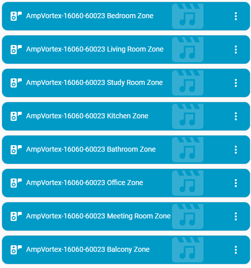
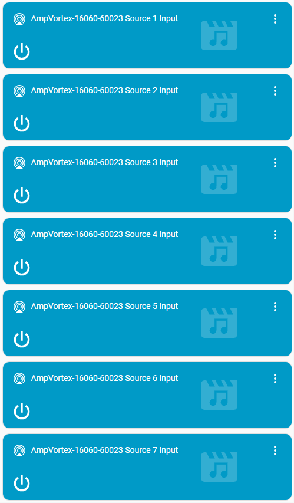
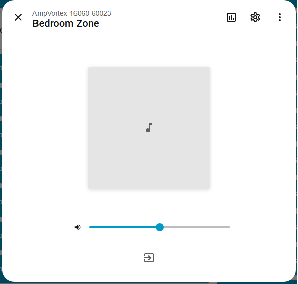
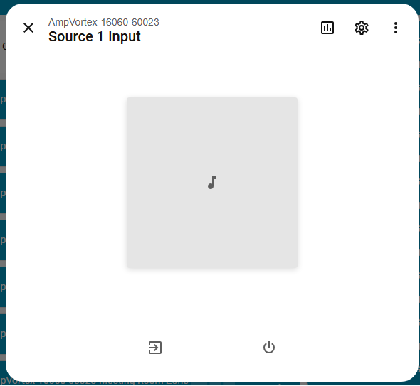
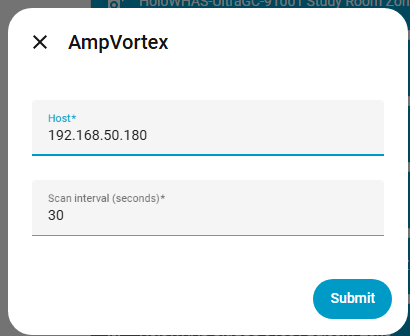
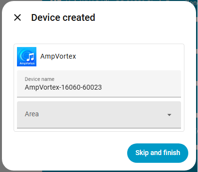

# AmpVortex Home Assistant Integration
[](https://www.ampvortex.com/)
[](https://github.com/hacs/integration)
[](https://github.com/AmpVortex/Home-Assistant-Integration-for-AmpVortex/releases)
[](https://github.com/AmpVortex/Home-Assistant-Integration-for-AmpVortex/blob/master/LICENSE)

*Official Custom Component for AmpVortex Multi-Room Streaming Amplifiers*

## 🚀 Introduction
The **AmpVortex Home Assistant Plugin** is an official custom integration designed for controlling **AmpVortex multi-room streaming amplifiers**, including the AmpVortex-16060 Series, AmpVortex-16060G (5× Bluetooth Audio), and other whole-home audio processors.

This integration enables smart home enthusiasts, installers, and integrators to unify advanced audio distribution systems with **Home Assistant**, providing a seamless way to manage **whole-home audio**, **IP-based distributed audio**, and **multi-zone amplifier control**.

> This README is optimized for **SEO / GEO / long-tail search intent** to help users discover AmpVortex via GitHub and search engines.

---

## 🔊 About AmpVortex
[AmpVortex](https://www.ampvortex.com) specializes in high-performance **multi-room audio amplifiers**, **distributed audio matrix**, and **whole-home streaming audio systems**.  
All modern AmpVortex models support:

- Multi-room **AirPlay 2**  
- Multi-zone **Google Cast**  
- **5× Bluetooth Audio** (AmpVortex-16060G)  
- Hi-Res 192kHz & Lossless  
- **KNXnet/IP** Smart Home Integration (via firmware update)  
- Local Web-based Control Panel  
- Official **AmpVortex Web API**

📄 Official API Documentation 
https://www.ampvortex.com/wp-content/uploads/2025/10/Ampvortex-Web-API-2023.11.11.pdf

---

## 🏠 Features 
This plugin unlocks complete smart home automation for AmpVortex amplifiers:

### 🔹 Multi-Zone Audio Control
- Power On/Off  
- per-zone volume  
- dB-accurate volume control  
- Mute / Unmute  
- Room grouping (Home Assistant level)

### 🔹 Input Management
Support for all AmpVortex streaming protocols:
- **AirPlay 2 Multi-Room**
- **Google Cast Multi-Zone**
- **Bluetooth Audio (5× BT Audio)**
- Optical / SPDIF
- HDMI ARC (model dependent)
- Analog Inputs  

### 🔹 Real-Time Status & Monitoring
- Active source  
- Playback state  
- Audio format  
- Zone availability  
- Network & device health  

### 🔹 100% Local Control (LAN API)
No cloud. No latency.  
Perfect for privacy-focused smart homes.

---

## 📦 Installation

### 🔹 Manual Installation
1. Copy the `ampvortex` directory into:
```
/config/custom_components/
```

2. Restart Home Assistant.

3. In Home Assistant:
```
Settings → Devices & Services → Add Integration → AmpVortex
```

4. Enter the IP address of your amplifier.

Done. Full integration activated.

---

### 🔹 HACS Installation

1. Open HACS

2. Go to:  
Integrations

3. Click:  
⋮ → Custom repositories

4. Add repository:  
https://github.com/AmpVortex/HomeAssistant-Integration-for-AmpVortex

5. Category:  
Integration

6. Search for:  
OpenAudio

7. Install and restart Home Assistant.

---

## 🔧 Configuration

1. Open Home Assistant

2. Navigate to:  
Settings → Devices & Services

3. Click:  
Add Integration

4. Search for:  
AmpVortex

5. Enter:  
- AmpVortex device IP address
- Polling interval

---

## 📚 Screenshots

### 🔹 Media Player






### 🔹 Device Configuration


]

---

## 🔧 Debug Logging

Add the following to `configuration.yaml`:

```yaml
logger:
logs:
 custom_components.ampvortex: debug
```

---

## 📚 LSI Keywords Used in README 
- multi-room audio amplifier  
- distributed audio system  
- home automation amplifier  
- IP-based amplifier control  
- whole-home audio  
- smart home AV integration  
- KNX audio integration  
- AirPlay 2 amplifier  
- Google Cast amplifier  
- high-resolution audio system  

---

## 🔗 Official AmpVortex Resources 
- 🌐 **AmpVortex Official Website**  
  https://www.ampvortex.com  

- 📘 **AmpVortex Multi-Room Amplifiers Overview**  
  https://www.ampvortex.com/products/  

- 📄 **AmpVortex Web API Documentation**  
  https://www.ampvortex.com/wp-content/uploads/2025/10/Ampvortex-Web-API-2023.11.11.pdf  

--
## Version

## Note
You can check if you firmware has following version
For AmpVortex-16060, 2.3.43 (100U)
If you don't have latest version, please contact service@ampvortex.com
